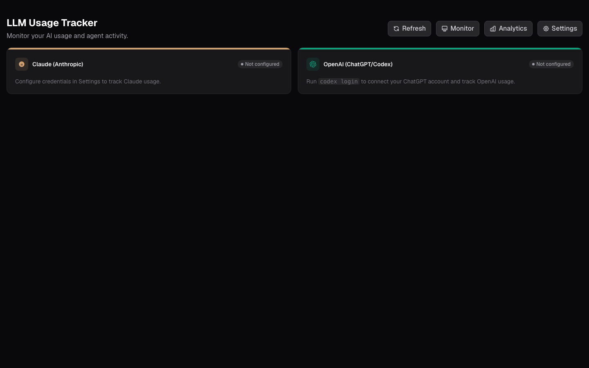
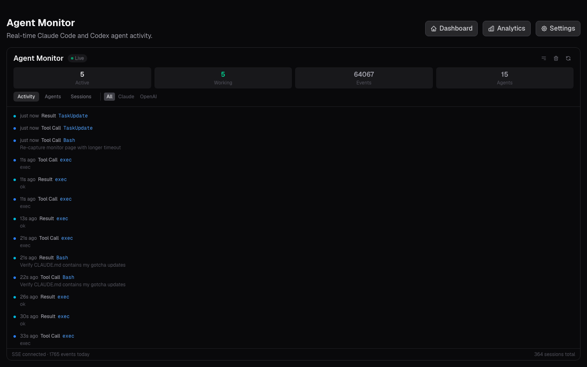
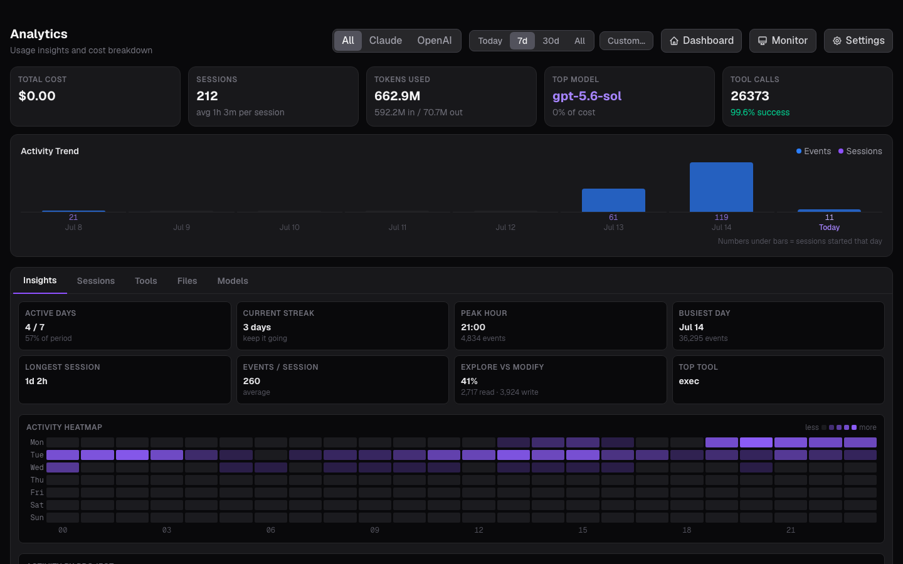
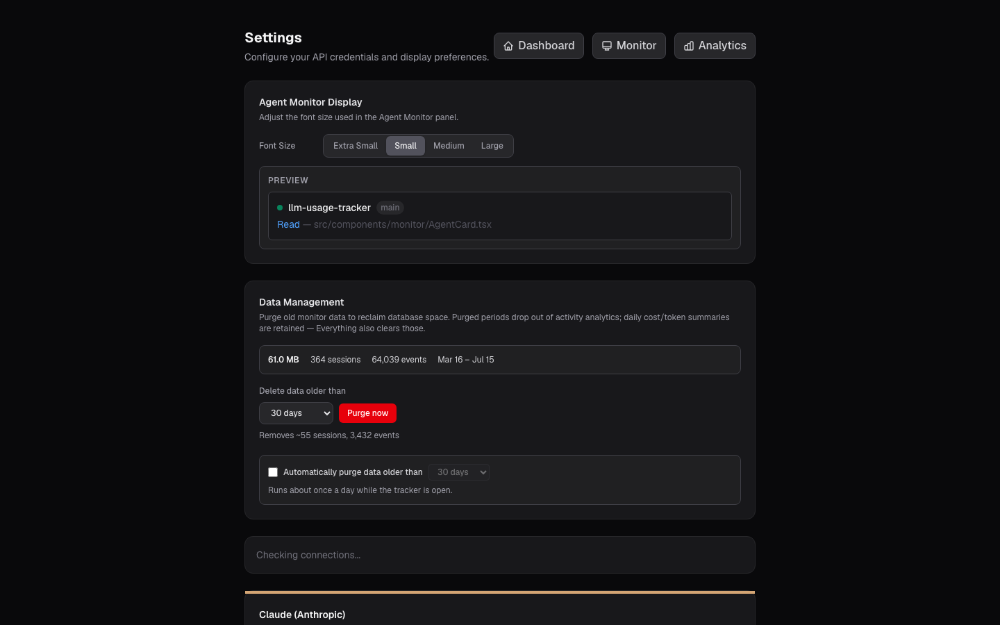
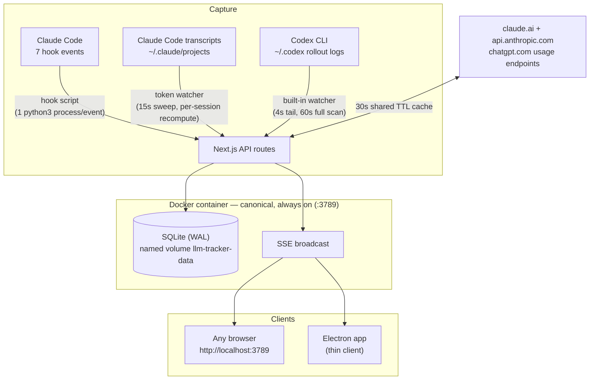

# LLM Usage Tracker

A macOS desktop + always-on Docker application that monitors your AI subscription quotas (Claude, OpenAI/Codex) and tracks every Claude Code and Codex agent session in real time — which tools they call, which files they touch, what it all costs, and how you work across the week.




---

## Table of Contents

- [What it does](#what-it-does)
- [The four pages](#the-four-pages)
- [Architecture](#architecture)
- [Quick start](#quick-start)
- [Claude Code hook setup](#claude-code-hook-setup)
- [Claude token usage (transcripts)](#claude-token-usage-transcripts)
- [OpenAI / Codex tracking](#openai--codex-tracking)
- [API reference](#api-reference)
- [Data management & retention](#data-management--retention)
- [Performance](#performance)
- [Troubleshooting](#troubleshooting)
- [Project structure](#project-structure)
- [Development](#development)

---

## What it does

**Quota monitoring.** Reads your real subscription usage straight from the providers: Claude's 5-hour and 7-day windows (with per-model breakdown, e.g. a scoped Fable/Opus limit) via your claude.ai session or Claude Code's OAuth token, and ChatGPT/Codex rate-limit windows via your Codex CLI login. No API keys are spent to do this — it reads the same usage endpoints the official apps use.

**Agent activity tracking.** A tiny hook script forwards every Claude Code lifecycle event (all 7 hook types) to the tracker, and a built-in watcher tails Codex CLI rollout logs. Every session, agent, subagent, tool call, and touched file lands in a local SQLite database and streams live into the UI over SSE.

**Token accounting for both providers.** Hook events don't carry token counts, so a second watcher derives Claude's per-model usage (input/output/cache read/cache write) from the transcripts Claude Code writes under `~/.claude/projects` — subagents included — while the Codex ingester reads cumulative totals from rollout logs. Every analytics view has real token data for Claude, OpenAI, and both combined.

**Analytics.** Activity trends, tool success rates and latencies, per-file modification hotspots, per-model token series, working-hours heatmaps, streaks, and explore-vs-modify ratios — over any date range, filterable by provider (All / Claude / OpenAI), with the **same metric set in every scope** so switching the filter compares numbers, not layouts.

**Private by construction.** Everything stays on your machine: a local SQLite file in a Docker named volume, AES-256-GCM-encrypted credentials, no telemetry.

## The four pages

### Dashboard — quota at a glance

Both providers side by side: Claude's 5-hour session window, 7-day window, and per-model scoped limits; OpenAI's 7-day window, per-feature limits, and available rate-limit resets. Cards auto-refresh every 60 s and can be refreshed manually.


### Monitor — live agent activity

A real-time feed of everything your agents are doing, streamed over SSE the moment a hook event arrives. Three tabs:

- **Activity** — the rolling event feed (tool calls, results, pauses, subagent spawns), color-coded by type
- **Agents** — one card per agent with live status (working / idle / completed / failed), the tool it's using *right now*, elapsed time, an expandable 200-event timeline, and the set of files it touched
- **Sessions** — per-session rollups: agent counts, event counts, cost

The strip along the top mirrors your quota windows so you can watch usage burn while agents work. Stats row: active sessions, working agents, total events, agent count. The provider filter (All / Claude / OpenAI) scopes everything.



### Analytics — how you actually use AI

Time-range presets (Today / 7d / 30d / All / custom) and a provider filter (All / Claude / OpenAI) that scopes every panel to the **same five overview cards**: total cost, sessions + average duration, tokens in/out, top model + its share of usage, tool calls + success rate. Below that, a token trend chart (falls back to event counts only when a scope has no token data, and adds a cost series only when there's a real dollar amount). Five drill-down tabs, each loaded on demand:

- **Insights** — active days, current streak, peak hour, busiest day, longest session, events/session, explore-vs-modify ratio (Codex `exec` commands are verb-classified: `cat`/`grep` count as explore, `sed -i`/`mv` as modify), top tool, a day×hour activity heatmap, and a per-project usage table
- **Sessions** — sortable table (duration, tokens, cost, tool count) with pagination
- **Tools** — most-used tools, success/failure rates, average tool latency (paired call→result timing)
- **Files** — most-modified files and directories, with the tools that touched them
- **Models** — usage share per model (by cost when a real cost is tracked, by token volume on flat subscriptions), token breakdown incl. cache read/write, and a per-model daily series

Since both providers here run flat subscriptions (cost $0), "top model" and the model charts rank by token volume — the number that actually moves.



### Settings — credentials, display, data

- **Claude credentials** — paste a claude.ai session key, pick your organization; stored encrypted (AES-256-GCM) on disk. If you use Claude Code, the app can read its OAuth token from the macOS Keychain instead — zero setup.
- **Monitor display** — font-size ladder for the monitor panel with a live preview.
- **Data management** — database size and row counts, age-based purge with an exact preview of what would be deleted (daily cost summaries are preserved), optional automatic retention (runs about once a day), and a full wipe.



## Architecture

The design principle: **one canonical database**. The Docker container is the always-on tracker; the Electron app is a thin client of it.



- **When the container is healthy**, the Electron app just loads `http://127.0.0.1:3789` — no second server, no second database. Its window opens instantly on a splash while it probes `/api/live` (a zero-I/O liveness endpoint).
- **Only when Docker is down** does Electron spawn its embedded Next.js standalone server — with **system Node**, never Electron's runtime — against its own fallback DB in `~/Library/Application Support/llm-usage-tracker/`. A parent watchdog guarantees that server dies with Electron, and a `did-fail-load` handler falls back mid-session if the container stops.
- **Port discovery for hooks**: in embedded/dev mode Electron writes its port to a `server-port` file; in thin-client mode the file is deliberately removed so hooks post only to `:3789`. The hook posts to *every* listening instance so no history is lost.
- **The SQLite DB lives in a Docker named volume** (`llm-tracker-data`) — never a macOS bind mount (see [Troubleshooting](#troubleshooting) for the WAL/mmap story). Use `npm run db:export` for a host-side snapshot.

**Database schema** (7 tables): `sessions`, `agents` (main agents + subagents, parent-linked), `agent_events` (every tool call/result/lifecycle event), `token_usage` (per-session per-model tokens + cost, both providers), `daily_usage` (rolled-up daily summaries that survive purges), `codex_ingest` (per-file cursors shared by the Codex and Claude-transcript watchers), `app_settings`.

## Quick start

### 1. The always-on tracker (Docker) — recommended first step

```bash
git clone <repo-url>
cd llm-usage-tracker

# Provide an encryption key for stored credentials (once)
echo "ENCRYPTION_KEY=$(openssl rand -hex 32)" > .env.local

docker compose up -d --build
open http://localhost:3789
```

That's the whole tracker: dashboard, monitor, analytics, settings, healthcheck (`docker ps` shows `(healthy)`), automatic restarts, Codex log ingestion and Claude transcript token ingestion (your `~/.codex` and `~/.claude/projects` are mounted read-only), and a stable `:3789` target for Claude Code hooks — capturing 24/7 whether or not the desktop app is open.

### 2. The desktop app (optional)

```bash
npm install
npm run electron:build     # → dist-electron/LLM Usage Tracker-<version>-arm64.dmg (~118 MB)
```

Install the DMG (or run `npx electron .` after a build). The app attaches to the Docker tracker when it's up and runs self-contained when it isn't. Menu-bar tray, hide-on-close, single-instance.

> Do **not** run `electron-rebuild` on this project — `better-sqlite3` is deliberately built for system Node everywhere (tests, dev, Docker, and the embedded fallback all share one ABI). If the module ever complains about `NODE_MODULE_VERSION`, run `npm rebuild better-sqlite3`.

### 3. Development

```bash
npm run dev            # Next.js dev server (UI + API) on :3000
npm test               # vitest — 133 tests
npm run electron:dev   # hot-reload Next.js + Electron shell
```

## Claude Code hook setup

The tracker captures Claude Code activity through its hooks system. One script handles all seven event types — it reads the hook payload from stdin, discovers every listening tracker instance (Electron port file → `:3789` → `:3000`), and POSTs the normalized event. It runs as a **single `python3` process per event** (~80-100 ms), never blocks Claude Code (every failure path exits 0 fast, with hard wall-clock bounds even on DNS stalls), and needs no configuration.

Register it in `~/.claude/settings.json` (adjust the path to your checkout):

```json
{
  "hooks": {
    "PreToolUse":   [{ "matcher": "", "hooks": [{ "type": "command", "command": "CLAUDE_HOOK_TYPE=PreToolUse '/path/to/llm-usage-tracker/hooks/agent-monitor-hook.sh'" }] }],
    "PostToolUse":  [{ "matcher": "", "hooks": [{ "type": "command", "command": "CLAUDE_HOOK_TYPE=PostToolUse '/path/to/llm-usage-tracker/hooks/agent-monitor-hook.sh'" }] }],
    "Stop":         [{ "matcher": "", "hooks": [{ "type": "command", "command": "CLAUDE_HOOK_TYPE=Stop '/path/to/llm-usage-tracker/hooks/agent-monitor-hook.sh'" }] }],
    "SubagentStop": [{ "matcher": "", "hooks": [{ "type": "command", "command": "CLAUDE_HOOK_TYPE=SubagentStop '/path/to/llm-usage-tracker/hooks/agent-monitor-hook.sh'" }] }],
    "SessionStart": [{ "matcher": "", "hooks": [{ "type": "command", "command": "CLAUDE_HOOK_TYPE=SessionStart '/path/to/llm-usage-tracker/hooks/agent-monitor-hook.sh'" }] }],
    "SessionEnd":   [{ "matcher": "", "hooks": [{ "type": "command", "command": "CLAUDE_HOOK_TYPE=SessionEnd '/path/to/llm-usage-tracker/hooks/agent-monitor-hook.sh'" }] }],
    "Notification": [{ "matcher": "", "hooks": [{ "type": "command", "command": "CLAUDE_HOOK_TYPE=Notification '/path/to/llm-usage-tracker/hooks/agent-monitor-hook.sh'" }] }]
  }
}
```

What each event becomes: `PreToolUse` → a `tool_call` (or `subagent_start` when the Agent tool spawns a subagent, with its type and description), `PostToolUse` → `tool_result`, `Stop` → the agent going idle, `SubagentStop` → subagent completion, `SessionStart`/`SessionEnd` → session lifecycle, `Notification` → notifications with context-compaction detection. File paths are extracted from tool inputs to power the Files analytics.

**Remote/cloud sessions**: set `MONITOR_URL=https://your-tunnel.example.com` in the hook command instead — see `hooks/claude-hooks-config.json` for both variants. A smoke test lives at `hooks/test-hook.sh`.

## Claude token usage (transcripts)

Hook events don't carry token counts, so Claude's token analytics come from a second source: the transcripts Claude Code writes under `~/.claude/projects`. A built-in watcher (15 s sweep, cursors persisted in the DB) recomputes a session's per-model totals whenever its transcript bytes change — no hook setup involved:

- **Session groups** — one session is `<uuid>.jsonl` plus everything under `<uuid>/subagents/**` (Task agents, workflow journals). Every line in those files carries the parent session id, so subagent usage rolls up into its session — and the ids match the ones the hooks report, so tokens attach to the sessions you already see in the monitor.
- **Exact accounting** — streaming repeats a message's `usage` on every content-block line, so usage is deduped per `message.id` (last line wins); each recompute REPLACE-upserts absolute totals, making ingestion idempotent and self-healing by construction.
- **History included** — first boot backfills the last 90 days (a few seconds for ~500 MB of transcripts; later boots only touch changed sessions). Sessions that predate the tracker get a synthetic completed `sessions` row so their usage still shows up in analytics.
- **Cost stays $0** — Claude Code runs on a flat subscription, so a dollar figure would be fiction (same policy as Codex). Analytics rank and chart by token volume instead.

One caveat: a `--resume`d session copies its inherited history into a new transcript, so that usage counts again under the new session — transcripts don't carry enough identity to dedupe across sessions.

## OpenAI / Codex tracking

Zero setup if you use the Codex CLI:

- **Quota** — the dashboard reads your ChatGPT/Codex rate-limit windows using the OAuth credentials in `~/.codex/auth.json`.
- **Activity** — the server tails `~/.codex/sessions/**/rollout-*.jsonl` (4-second tail of today's directory, full rescan once a minute, byte-offset cursors so nothing is re-read), converting Codex turns into the same sessions/agents/events model. In Docker, `~/.codex` is mounted read-only; tokens never leave the machine.
- In analytics, Codex `exec` shell commands are classified by verb into explore vs. modify so the ratio stays honest across both providers.

## API reference

All routes return `{ "success": true, "data": ... }` or `{ "success": false, "error": { "code", "message" } }`.

| Endpoint | Method | Description |
|----------|--------|-------------|
| `/api/live` | GET | Zero-I/O liveness probe (used by the Electron docker-probe and container HEALTHCHECK) |
| `/api/health` | GET | Provider connectivity — verifies Claude + OpenAI upstream access (parallel, shares the usage cache) |
| `/api/usage/claude` | GET | Claude quota windows + per-model breakdown (30 s server-side cache) |
| `/api/usage/openai` | GET | ChatGPT/Codex quota windows (30 s server-side cache) |
| `/api/organizations/claude` | GET | List organizations for a session key |
| `/api/credentials` | GET/POST/DELETE | Encrypted credential storage (mutations invalidate the usage caches) |
| `/api/monitor/stats` | GET | Header stats (`?provider=`) |
| `/api/monitor/agents` | GET/POST | List (`?limit`, `?status`, `?provider`) / register agents |
| `/api/monitor/agents/:id` | GET/PUT | Get / update one agent |
| `/api/monitor/events` | GET/POST | Recent events across agents (`?limit`, `?provider`) / **hook ingestion endpoint** |
| `/api/monitor/events/:agentId` | GET | One agent's events (`?limit`, `?order=asc\|desc`) |
| `/api/monitor/sessions` | GET | Sessions with aggregates (`?provider`) |
| `/api/monitor/sessions/:id` | GET | One session + its agents |
| `/api/monitor/stream` | GET | **SSE** — `agent_created/updated`, `event_created`, `session_*`, `stats_updated` |
| `/api/monitor/storage` | GET | DB file size, WAL size, row counts, data date range |
| `/api/monitor/purge` | GET/POST | Preview / run age-based purge (`?days`), keeps daily summaries |
| `/api/monitor/retention` | GET/POST | Auto-retention setting (daily purge while the tracker runs) |
| `/api/monitor/clear` | DELETE | Wipe all monitor data |
| `/api/analytics/overview` | GET | Cost, sessions, tokens, top model, success rate (`?from&to&provider`) |
| `/api/analytics/trends` | GET | Bucketed activity/cost series (`?granularity=hourly\|daily`) |
| `/api/analytics/sessions` | GET | Session table (`?sort&order&limit&offset`) |
| `/api/analytics/tools` | GET | Per-tool counts, success rates, avg duration + timeline |
| `/api/analytics/files` | GET | Most-modified files and directories |
| `/api/analytics/models` | GET | Per-model cost/token series |
| `/api/analytics/insights` | GET | Heatmap, projects, streaks, explore-vs-modify |

## Data management & retention

- **Storage** — a single SQLite file (WAL mode) in the `llm-tracker-data` named volume; typical size ~60 MB for a few months of heavy use.
- **Purge with preview** — Settings shows exactly how many sessions/agents/events a purge would remove before you run it. Purged periods keep their `daily_usage` rollups, so long-term cost charts survive.
- **Auto-retention** — opt-in; runs at most once per 24 h while the tracker is up.
- **Snapshot** — `npm run db:export` copies a consistent backup out of the named volume to `./.docker-data/agent-monitor.export.db` (the live DB is intentionally not reachable from the host).

## Performance

This codebase went through a measured optimization pass (2026-07-14/15) with every change verified against the production dataset (~64 K events). Same hardware, same data:

| Hot path | Before | After |
|---|---|---|
| `/api/analytics/tools` | 7.88 s | **0.14 s** (57×) — two per-tool N+1 loops (one a self-join over all events) became two single-pass window-function queries |
| `/api/analytics/sessions` | 2.10 s | **0.03 s** (84×) — correlated subqueries → grouped `LEFT JOIN`s |
| `/api/health` | 1.62 s | **0.03 s** warm — serial upstream calls → `Promise.allSettled` + a 30 s cache shared with the usage routes |
| Keychain token lookup | 2 subprocesses per request | cached 5 min (60 s retry floor after auth failures) |
| Analytics page network | 7 endpoints + 3 duplicate rollups every 60 s | 3 on load; tabs fetch on demand; rollups deduped per range/minute |
| Monitor idle CPU | every card re-parsed its events JSON every second | memoized derivations, `React.memo` cards, shared tick pauses when the tab is hidden |
| Hook cost per Claude Code event | ~6 processes (cat, nc×3, python3, curl×N) | **1 python3 process**, 78-99 ms |
| Codex watcher | full `~/.codex` tree walk every 4 s | today's dir per tick, full walk per minute; 90-day backfill in 46 ms |
| Electron cold start | up to 7.5 s of no window (probing `/api/health`, which calls both providers) | instant window + splash; probes hit zero-I/O `/api/live` |
| Packaged app | 188 MB DMG that shipped the **live database and encryption key** | **118 MB**, zero secrets, 328 MB of unused `node_modules` gone |
| SQLite | defaults | `synchronous=NORMAL`, `busy_timeout=5000`, composite hot-path indexes, cached prepared statements |

Infrastructure: the container now has a real `HEALTHCHECK` (against `/api/live`), SSE frames are encoded once per event instead of once per client, and event feeds are capped (200/agent rolling window) so week-long sessions don't grow memory without bound.

## Troubleshooting

**Every query suddenly fails with `SQLITE_NOTADB` / "database disk image is malformed" (Docker).**
You bind-mounted the DB directory on macOS. WAL keeps its wal-index in an mmap'd `-shm` file, and Docker Desktop's VirtioFS doesn't give mmap the coherence SQLite needs — the container reads garbage while the file on disk is perfectly fine. Keep the DB on the **named volume** (the compose file already does); use `npm run db:export` for host access.

**`better-sqlite3` errors with `NODE_MODULE_VERSION` mismatch.**
Something rebuilt it for the wrong runtime. `npm rebuild better-sqlite3` restores the one true state (system-Node ABI). Never run `electron-rebuild` here — the embedded server is spawned with system Node, so Electron's ABI is irrelevant.

**Hooks feel slow / events missing.**
Check for a stale port file: `ls "~/Library/Application Support/llm-usage-tracker/server-port"`. It must exist only while an embedded/dev server is actually running — the app removes it in thin-client mode, on quit, and on server exit, and the hook self-heals a dead-port file, but if a server was SIGKILLed the old way, delete the file. The hook can be tested any time with `bash hooks/test-hook.sh`.

**The Electron app started its own server even though Docker is up.**
The container was probably still booting (probe window is ~8 s with retries). Quit and reopen the app — mid-session it also re-attaches only via restart by design (one DB at a time). Verify the container first: `curl http://127.0.0.1:3789/api/live`.

**Claude card says "Session key expired".**
Grab a fresh `sessionKey` cookie from claude.ai (DevTools → Application → Cookies) and paste it in Settings. If Claude Code is installed and logged in, the Keychain OAuth path usually makes this unnecessary.

**UI changes don't appear after rebuilding.**
Delete `.next/cache` and rebuild. For Electron: `npm run build && npm run electron:compile`, then `pkill -9 -f "node_modules/electron/dist"` (scoped pattern — don't pkill bare "electron") and relaunch.

## Project structure

```
llm-usage-tracker/
├── electron/                    # Electron main process (TypeScript → compiled at build time)
│   ├── main.ts                  #   lifecycle: /api/live docker-probe, splash-first window,
│   │                            #   embedded-server spawn (system Node), port-file contract
│   ├── parent-watchdog.ts       #   injected via --require: embedded server dies with Electron
│   ├── tray.ts                  #   menu-bar tray
│   └── preload.ts
├── hooks/
│   ├── agent-monitor-hook.sh    # thin wrapper (keeps ~/.claude/settings.json stable)
│   ├── agent-monitor-hook.py    # the actual hook: parse → discover ports → POST (one process)
│   ├── claude-hooks-config.json # copy-paste hook config (local + tunnel variants)
│   └── test-hook.sh             # smoke test for all 7 event types
├── src/
│   ├── app/                     # Next.js App Router: / (dashboard), /monitor, /analytics, /settings
│   │   └── api/                 # all routes listed in the API reference
│   ├── components/              # dashboard/, monitor/, analytics/, settings/, ui/
│   ├── hooks/                   # use-agent-monitor (SSE + SWR), use-analytics (lazy tabs),
│   │                            # use-usage-data, use-now (visibility-aware shared tick), ...
│   ├── lib/
│   │   ├── db.ts                # schema, migrations, prepared-statement cache, all queries
│   │   ├── ws.ts                # SSE broadcast (one encoded frame per event)
│   │   ├── ttl-cache.ts         # promise-aware TTL memo (usage + health share it)
│   │   ├── activity-merge.ts    # merge server history with live SSE events
│   │   ├── exec-classify.ts     # Codex exec verb classification (explore vs modify)
│   │   ├── credentials.ts       # AES-256-GCM storage
│   │   └── providers/           # claude-client, openai-client, codex-watcher, codex-ingest,
│   │                            # claude-watcher + claude-transcript (token ingestion),
│   │                            # usage-cache (shared 30s TTL)
│   └── types/
├── docs/screenshots/            # README images
├── Dockerfile                   # multi-stage; standalone output; HEALTHCHECK /api/live
├── docker-compose.yml           # :3789, named volume, ~/.codex + ~/.claude/projects ro-mounts, TZ passthrough
└── package.json                 # electron-builder config: standalone ships via extraResources
```

## Development

| Command | Description |
|---------|-------------|
| `npm run dev` | Next.js dev server (UI + API + Codex watcher) |
| `npm test` | vitest suite (133 tests: schema, queries, purge, providers, codex ingest, claude transcripts, throttles, SSE) |
| `npm run build` | Production build (standalone output + static assets) |
| `npm run electron:dev` | Hot-reload development with the Electron shell |
| `npm run electron:build` | Clean → build → compile → package DMG + zip |
| `npm run db:export` | Consistent DB snapshot out of the Docker volume |
| `docker compose up -d --build` | Rebuild + restart the canonical tracker |
| `bash hooks/test-hook.sh` | Fire one synthetic event of each hook type |

Style: TypeScript strict throughout; Tailwind (dark zinc theme); raw SQL with prepared statements (no ORM); DB functions synchronous by design (`better-sqlite3`); API responses always `{ success, data | error }`.

## License

MIT
