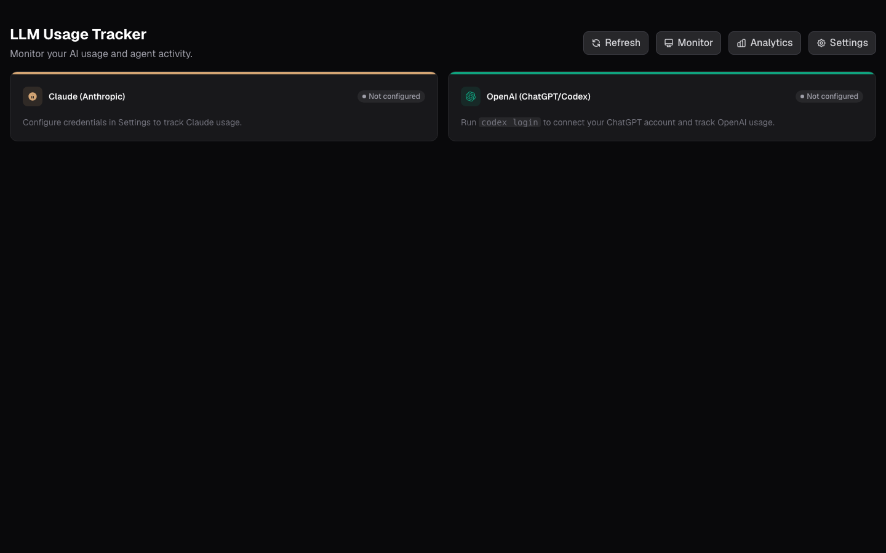
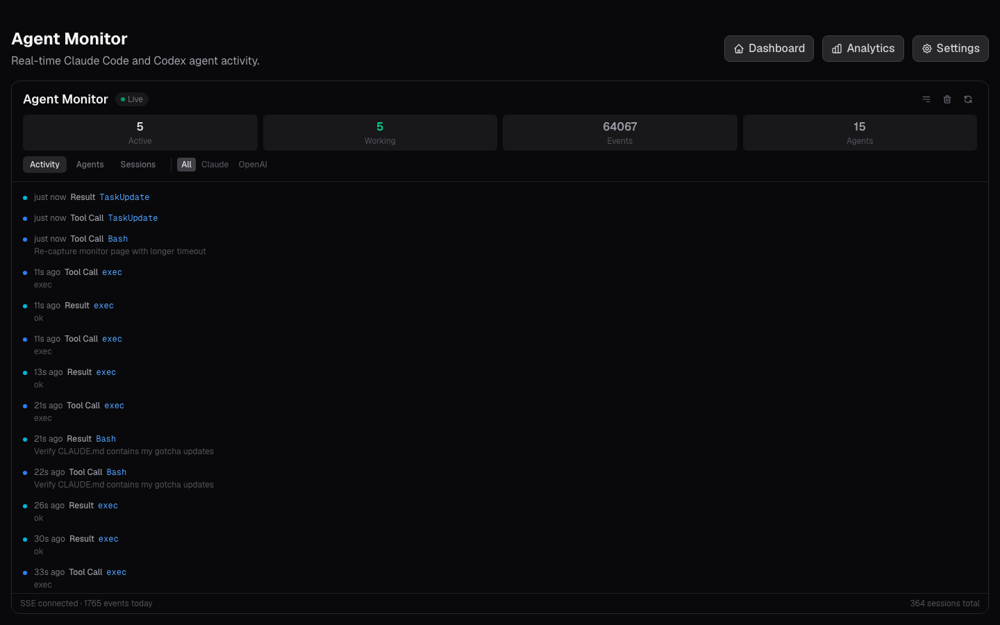
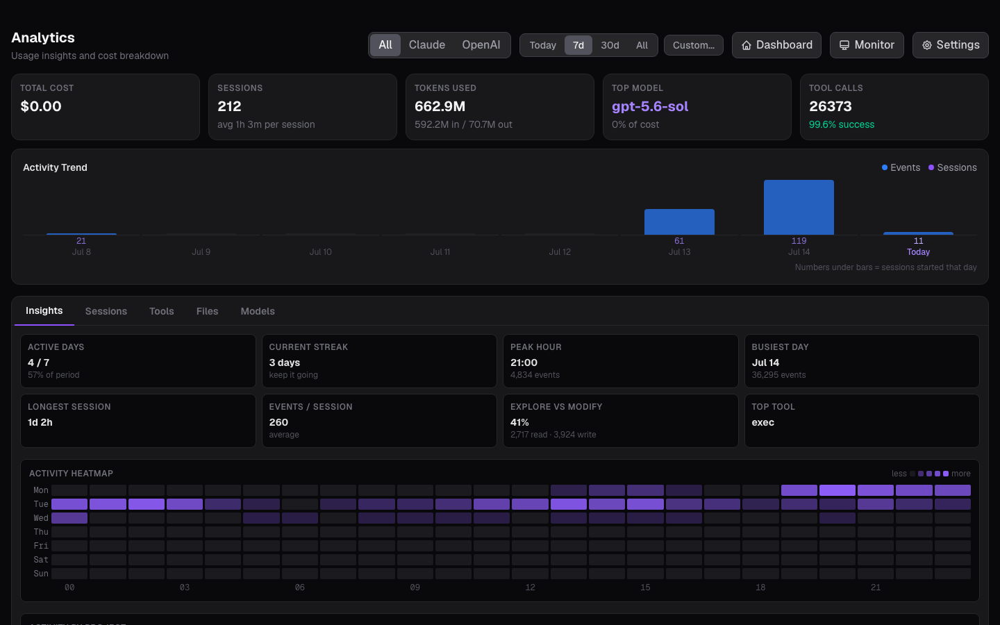
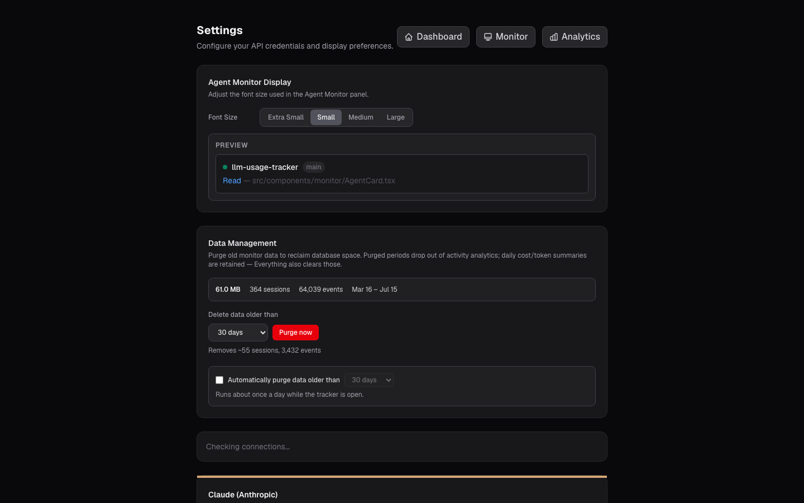
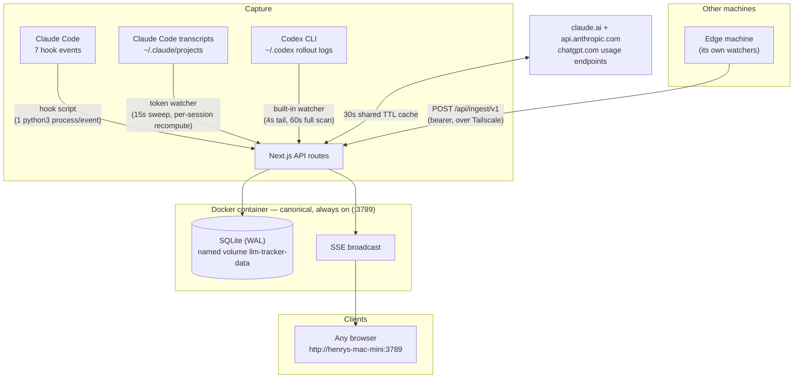

# LLM Usage Tracker

An always-on Docker application, opened in any browser, that monitors your AI subscription quotas (Claude, OpenAI/Codex) and tracks every Claude Code and Codex agent session in real time — which tools they call, which files they touch, what it all costs, and how you work across the week. Run one container as a hub and several machines report into it.




---

## Table of Contents

- [What it does](#what-it-does)
- [The four pages](#the-four-pages)
- [Architecture](#architecture)
- [Quick start](#quick-start)
- [Claude Code hook setup](#claude-code-hook-setup)
- [Claude token usage (transcripts)](#claude-token-usage-transcripts)
- [OpenAI / Codex tracking](#openai--codex-tracking)
- [Multi-machine hub](#multi-machine-hub)
- [Shipping from another machine (the edge)](#shipping-from-another-machine-the-edge)
- [API reference](#api-reference)
- [Data management & retention](#data-management--retention)
- [Performance](#performance)
- [Troubleshooting](#troubleshooting)
- [Project structure](#project-structure)
- [Development](#development)

---

## What it does

**Quota monitoring.** Reads your real subscription usage straight from the providers: Claude's 5-hour and 7-day windows (with per-model breakdown, e.g. a scoped Fable/Opus limit) via your claude.ai session or Claude Code's OAuth token, and ChatGPT/Codex rate-limit windows via your Codex CLI login. No API keys are spent to do this — it reads the same usage endpoints the official apps use.

**Agent activity tracking.** A tiny hook script forwards every Claude Code lifecycle event (all 7 hook types) to the tracker, and a built-in watcher tails Codex CLI rollout logs. Every session, agent, subagent, tool call, and touched file lands in a local SQLite database and streams live into the UI over SSE.

**Token accounting for both providers.** Hook events don't carry token counts, so a second watcher derives Claude's per-model usage (input/output/cache read/cache write) from the transcripts Claude Code writes under `~/.claude/projects` — subagents included — while the Codex ingester reads cumulative totals from rollout logs. Every analytics view has real token data for Claude, OpenAI, and both combined.

**Analytics.** Activity trends, tool success rates and latencies, per-file modification hotspots, per-model token series, working-hours heatmaps, streaks, and explore-vs-modify ratios — over any date range, filterable by provider (All / Claude / OpenAI) and by machine (All / each machine reporting into the hub), with the **same metric set in every scope** so switching a filter compares numbers, not layouts.

**Browser-only, no install.** The hub is the product: a Docker container serving the whole UI at a URL you open in any browser on your tailnet. There is no desktop app to download or keep up to date.

**Private by construction.** Everything stays on your machine: a local SQLite file in a Docker named volume, AES-256-GCM-encrypted credentials, no telemetry.

## The four pages

### Dashboard — quota at a glance

Both providers side by side: Claude's 5-hour session window, 7-day window, and per-model scoped limits; OpenAI's 7-day window, per-feature limits, and available rate-limit resets. Cards auto-refresh every 60 s and can be refreshed manually.


### Monitor — live agent activity

A real-time feed of everything your agents are doing, streamed over SSE the moment a hook event arrives. Three tabs:

- **Activity** — the rolling event feed (tool calls, results, pauses, subagent spawns), color-coded by type
- **Agents** — one card per agent with live status (working / idle / completed / failed), the tool it's using *right now*, elapsed time, an expandable 200-event timeline, and the set of files it touched
- **Sessions** — per-session rollups: agent counts, event counts, cost

The strip along the top mirrors your quota windows so you can watch usage burn while agents work. Stats row: active sessions, working agents, total events, agent count. Two filters scope every tab: provider (All / Claude / OpenAI) and machine (All, or one of the machines reporting into the hub — the machine filter only appears once a second machine has reported).



### Analytics — how you actually use AI

Time-range presets (Today / 7d / 30d / All / custom) plus provider (All / Claude / OpenAI) and machine (All / per-machine) filters that scope every panel to the **same five overview cards**: total cost, sessions + average duration, tokens in/out, top model + its share of usage, tool calls + success rate. Below that, a token trend chart (falls back to event counts only when a scope has no token data, and adds a cost series only when there's a real dollar amount). Five drill-down tabs, each loaded on demand:

- **Insights** — active days, current streak, peak hour, busiest day, longest session, events/session, explore-vs-modify ratio (Codex `exec` commands are verb-classified: `cat`/`grep` count as explore, `sed -i`/`mv` as modify), top tool, a day×hour activity heatmap, and a per-project usage table
- **Sessions** — sortable table (duration, tokens, cost, tool count) with pagination
- **Tools** — most-used tools, success/failure rates, average tool latency (paired call→result timing)
- **Files** — most-modified files and directories, with the tools that touched them
- **Models** — usage share per model (by cost when a real cost is tracked, by token volume on flat subscriptions), token breakdown incl. cache read/write, and a per-model daily series

Since both providers here run flat subscriptions (cost $0), "top model" and the model charts rank by token volume — the number that actually moves.



### Settings — credentials, display, data

- **Hub** — the hub URL edge machines post to (`NEXT_PUBLIC_HUB_URL`), read-only: it's read from the running container's environment, not from the browser, so what you see is what the hub is actually configured with.
- **Claude credentials** — paste a claude.ai session key, pick your organization; stored encrypted (AES-256-GCM) on disk. If you use Claude Code, the app can read its OAuth token from the macOS Keychain instead — zero setup.
- **Monitor display** — font-size ladder for the monitor panel with a live preview.
- **Data management** — database size and row counts, age-based purge with an exact preview of what would be deleted (daily cost summaries are preserved), optional automatic retention (runs about once a day), and a full wipe.



## Architecture

The design principle: **one canonical database**. The Docker container is the always-on tracker and the only server; every client is a browser pointed at it.


```mermaid
flowchart TB
    subgraph capture [Capture]
        CC["Claude Code<br/>7 hook events"] -->|"hook script<br/>(1 python3 process/event)"| API
        CT["Claude Code transcripts<br/>~/.claude/projects"] -->|"token watcher<br/>(15s sweep, per-session recompute)"| API
        CX["Codex CLI<br/>~/.codex rollout logs"] -->|"built-in watcher<br/>(4s tail, 60s full scan)"| API
    end

    subgraph docker ["Docker container — canonical, always on (:3789)"]
        API["Next.js API routes"] --> DB[("SQLite (WAL)<br/>named volume llm-tracker-data")]
        API --> SSE["SSE broadcast"]
    end

    subgraph edges [Other machines]
        EDGE["Edge machine<br/>(its own watchers)"] -->|"POST /api/ingest/v1<br/>(bearer, over Tailscale)"| API
    end

    subgraph clients [Clients]
        BROWSER["Any browser<br/>http://henrys-mac-mini:3789"]
    end

    SSE --> BROWSER
    UP["claude.ai + api.anthropic.com<br/>chatgpt.com usage endpoints"] <-->|"30s shared TTL cache"| API
```

- **One server, many browsers.** The container serves the UI and the API on `:3789`; you open it in any browser on the tailnet. There is nothing to install per client, and no second database to reconcile. (An `electron/` shell exists in the tree from an earlier iteration and is no longer part of the product — see [Development](#development).)
- **Other machines are edges, not clients.** A second machine runs its own watchers and posts batches to `POST /api/ingest/v1` with its `machine_id`; it doesn't run its own UI or DB. The Monitor and Analytics pages then scope to All or to a single machine.
- **The SQLite DB lives in a Docker named volume** (`llm-tracker-data`) — never a macOS bind mount (see [Troubleshooting](#troubleshooting) for the WAL/mmap story). Use `npm run db:export` for a host-side snapshot.

**Database schema** (7 tables): `sessions`, `agents` (main agents + subagents, parent-linked), `agent_events` (every tool call/result/lifecycle event), `token_usage` (per-session per-model tokens + cost, both providers), `daily_usage` (rolled-up daily summaries that survive purges), `codex_ingest` (per-file cursors shared by the Codex and Claude-transcript watchers), `app_settings`.

## Quick start

### 1. The always-on tracker (Docker) — recommended first step

```bash
git clone <repo-url>
cd llm-usage-tracker

# Provide an encryption key for stored credentials (once)
echo "ENCRYPTION_KEY=$(openssl rand -hex 32)" > .env.local

docker compose up -d --build
open http://localhost:3789
```

That's the whole tracker: dashboard, monitor, analytics, settings, healthcheck (`docker ps` shows `(healthy)`), automatic restarts, and a stable `:3789` target for Claude Code hooks — capturing 24/7. Open it in a browser; there is nothing else to install.

Codex log ingestion and Claude transcript token ingestion read the *host's* `~/.codex` and `~/.claude/projects`, which the base compose file no longer mounts — in a multi-machine setup each machine watches its own logs and posts to the hub. To have this container also watch its own host (the single-machine setup), add the overlay:

```bash
docker compose -f docker-compose.yml -f docker-compose.local-watchers.yml up -d
```

### 2. Development

```bash
npm install
npm run dev            # Next.js dev server (UI + API) on :3000
npm test               # vitest — 194 tests
```

> `better-sqlite3` is deliberately built for system Node everywhere (tests, dev, Docker). If it ever complains about `NODE_MODULE_VERSION`, run `npm rebuild better-sqlite3`.

## Claude Code hook setup

The tracker captures Claude Code activity through its hooks system. One script handles all seven event types — it reads the hook payload from stdin, discovers every listening tracker instance (`:3789` hub → `:3000` dev server, plus a legacy port file if one is left over), and POSTs the normalized event. It runs as a **single `python3` process per event** (~80-100 ms), never blocks Claude Code (every failure path exits 0 fast, with hard wall-clock bounds even on DNS stalls), and needs no configuration.

Register it in `~/.claude/settings.json` (adjust the path to your checkout):

```json
{
  "hooks": {
    "PreToolUse":   [{ "matcher": "", "hooks": [{ "type": "command", "command": "CLAUDE_HOOK_TYPE=PreToolUse '/path/to/llm-usage-tracker/hooks/agent-monitor-hook.sh'" }] }],
    "PostToolUse":  [{ "matcher": "", "hooks": [{ "type": "command", "command": "CLAUDE_HOOK_TYPE=PostToolUse '/path/to/llm-usage-tracker/hooks/agent-monitor-hook.sh'" }] }],
    "Stop":         [{ "matcher": "", "hooks": [{ "type": "command", "command": "CLAUDE_HOOK_TYPE=Stop '/path/to/llm-usage-tracker/hooks/agent-monitor-hook.sh'" }] }],
    "SubagentStop": [{ "matcher": "", "hooks": [{ "type": "command", "command": "CLAUDE_HOOK_TYPE=SubagentStop '/path/to/llm-usage-tracker/hooks/agent-monitor-hook.sh'" }] }],
    "SessionStart": [{ "matcher": "", "hooks": [{ "type": "command", "command": "CLAUDE_HOOK_TYPE=SessionStart '/path/to/llm-usage-tracker/hooks/agent-monitor-hook.sh'" }] }],
    "SessionEnd":   [{ "matcher": "", "hooks": [{ "type": "command", "command": "CLAUDE_HOOK_TYPE=SessionEnd '/path/to/llm-usage-tracker/hooks/agent-monitor-hook.sh'" }] }],
    "Notification": [{ "matcher": "", "hooks": [{ "type": "command", "command": "CLAUDE_HOOK_TYPE=Notification '/path/to/llm-usage-tracker/hooks/agent-monitor-hook.sh'" }] }]
  }
}
```

What each event becomes: `PreToolUse` → a `tool_call` (or `subagent_start` when the Agent tool spawns a subagent, with its type and description), `PostToolUse` → `tool_result`, `Stop` → the agent going idle, `SubagentStop` → subagent completion, `SessionStart`/`SessionEnd` → session lifecycle, `Notification` → notifications with context-compaction detection. File paths are extracted from tool inputs to power the Files analytics.

**Remote hub**: run the [edge shipper](edge/README.md) on this machine and use `hooks/edge-hook.sh` instead — same payload, but it posts to the local edge, which spools to disk and forwards to the hub.

**Remote/cloud sessions**: set `MONITOR_URL=https://your-tunnel.example.com` in the hook command instead — see `hooks/claude-hooks-config.json` for all three variants. A smoke test lives at `hooks/test-hook.sh` (`MONITOR_URL=http://127.0.0.1:3799 bash hooks/test-hook.sh` aims it at the edge).

## Claude token usage (transcripts)

Hook events don't carry token counts, so Claude's token analytics come from a second source: the transcripts Claude Code writes under `~/.claude/projects`. A built-in watcher (15 s sweep, cursors persisted in the DB) recomputes a session's per-model totals whenever its transcript bytes change — no hook setup involved:

- **Session groups** — one session is `<uuid>.jsonl` plus everything under `<uuid>/subagents/**` (Task agents, workflow journals). Every line in those files carries the parent session id, so subagent usage rolls up into its session — and the ids match the ones the hooks report, so tokens attach to the sessions you already see in the monitor.
- **Exact accounting** — streaming repeats a message's `usage` on every content-block line, so usage is deduped per `message.id` (last line wins); each recompute REPLACE-upserts absolute totals, making ingestion idempotent and self-healing by construction.
- **History included** — first boot backfills the last 90 days (a few seconds for ~500 MB of transcripts; later boots only touch changed sessions). Sessions that predate the tracker get a synthetic completed `sessions` row so their usage still shows up in analytics.
- **Cost stays $0** — Claude Code runs on a flat subscription, so a dollar figure would be fiction (same policy as Codex). Analytics rank and chart by token volume instead.

One caveat: a `--resume`d session copies its inherited history into a new transcript, so that usage counts again under the new session — transcripts don't carry enough identity to dedupe across sessions.

## OpenAI / Codex tracking

Zero setup if you use the Codex CLI:

- **Quota** — the dashboard reads your ChatGPT/Codex rate-limit windows using the OAuth credentials in `~/.codex/auth.json`.
- **Activity** — the server tails `~/.codex/sessions/**/rollout-*.jsonl` (4-second tail of today's directory, full rescan once a minute, byte-offset cursors so nothing is re-read), converting Codex turns into the same sessions/agents/events model. In Docker, `~/.codex` is mounted read-only; tokens never leave the machine.
- In analytics, Codex `exec` shell commands are classified by verb into explore vs. modify so the ratio stays honest across both providers.

## Multi-machine hub

Several machines can report into one always-on tracker. Every usage row carries a `machine_id`:

- **`local`** — written by the in-process watchers and by the unauthenticated `POST /api/monitor/events` path that Claude Code hooks use. A single-machine install only ever sees this, and behaves exactly as before.
- **anything else** — a stable id (a UUID is ideal) that a remote machine sends with each batch to `POST /api/ingest/v1`.

Session and agent ids come from the provider and are only unique *per machine*, so `machine_id` is part of the primary key of `sessions`, `agents`, `token_usage` and `daily_usage`, and the `source_id` idempotency index on `agent_events` is scoped to `(machine_id, source_id)`. Two machines can report the same session id without colliding. Existing databases are migrated in place on first open, with every pre-existing row backfilled to `local`.

### Running one machine as the hub

```bash
# On the hub (e.g. henrys-mac-mini, reachable over Tailscale)
echo "INGEST_TOKEN=$(openssl rand -hex 32)" >> .env.local
docker compose up -d --build
```

| Env var | Default | Purpose |
|---------|---------|---------|
| `INGEST_TOKEN` | *(unset)* | Shared bearer token for `/api/ingest/v1`. **Unset means every ingest is refused with 503** — a hub on a tailnet must never accept anonymous writes. |
| `NEXT_PUBLIC_HUB_URL` | `http://henrys-mac-mini:3789` | Where edge machines post. Env-only: no hostname is hardcoded in the app. |
| `TZ` | `Asia/Phnom_Penh` | Day bucketing for `localtime` rollups. |

Auth v1 is a shared bearer token over plain HTTP on the tailnet — Tailscale provides the transport security. No mTLS, and SQLite stays the single-writer store; a multi-replica VPS deployment would need Postgres instead.

### Posting a batch

```bash
curl -X POST http://henrys-mac-mini:3789/api/ingest/v1 \
  -H "Authorization: Bearer $INGEST_TOKEN" \
  -H "content-type: application/json" \
  -d '{
    "machine_id": "b6b3f0f4-6f1a-4a1e-9a9f-2f2a6e0f1c34",
    "label": "MacBook Pro",
    "events": [
      { "source_id": "hook:1730000000:1", "agent_id": "agent-1", "session_id": "sess-1",
        "event_type": "session_start", "agent_project": "my-app", "agent_entrypoint": "cli",
        "provider": "anthropic", "timestamp": 1730000000000 }
    ]
  }'
# → { "success": true, "data": { "machine_id": "…", "accepted": 1, "duplicates": 0 } }
```

- `source_id` is a required, stable idempotency key. Replaying a batch is safe: duplicates are counted, never re-inserted, and lifecycle side effects aren't re-run.
- Batches are capped at 500 events (400 past the cap); a batch is validated in full before anything is written.
- Events go through the same lifecycle handling as the local hook path — session start/end, agent auto-registration, subagent routing, daily rollup.

### Shipping from another machine (the edge)

Machines that aren't the hub run the **edge shipper** in `edge/` — a
zero-dependency Node agent. Claude Code hooks post to a loopback intake, events
land in a durable on-disk spool, and a flusher forwards them to
`/api/ingest/v1` in batches with the bearer token:

```
Claude Code hook ──POST 127.0.0.1:3799──▶ edge ──spool──▶ hub /api/ingest/v1
```

```bash
# On grok-bot-box (Linux) or henrymacbook-pro (macOS)
mkdir -p ~/.config/llm-usage-tracker-edge
cat > ~/.config/llm-usage-tracker-edge/.env <<'EOF'
TRACKER_URL=http://henrys-mac-mini:3789
MACHINE_ID=grok-bot-box
MACHINE_LABEL=Grok Bot box
EOF
read -rs -p "INGEST_TOKEN: " T && printf 'INGEST_TOKEN=%s\n' "$T" >> ~/.config/llm-usage-tracker-edge/.env && unset T
chmod 600 ~/.config/llm-usage-tracker-edge/.env

node edge/bin/llm-edge.js start          # foreground; launchd/systemd units in edge/README.md
node edge/bin/llm-edge.js status         # queue depth + effective config (token redacted)
```

Then point the hooks at `hooks/edge-hook.sh` (the `hooks_edge` block in
`hooks/claude-hooks-config.json`). This is what removes the need to mount a
remote machine's `~/.claude` / `~/.codex` on the hub: hook events travel over
the tailnet, buffered on disk when it's down. Events keep their idempotency key,
so a retried batch is deduped rather than duplicated.

**macOS and Linux in v1**; Windows is roadmap (the code is path-portable, but no
service installer is provided yet). Full install, service units, CLI, config
table and troubleshooting: [`edge/README.md`](edge/README.md).

### Filtering the UI by machine

`GET /api/machines` lists every machine the hub has heard from (`id`, `label`, `last_seen_at`, newest first) and populates a **machine filter** on Monitor and Analytics, next to the provider filter. It appears only once a second machine has reported — on a single-machine hub, All *is* that machine.

- **All** sends no `machine` parameter: the query stays unscoped, exactly like the provider filter's All.
- Picking a machine appends `?machine=<id>` to every request the page makes. Every route that accepts `?provider=` now also accepts `?machine=`, and the two combine.
- `machine` is validated against the same charset ingest enforces (`[A-Za-z0-9._:-]`, 1-128 chars). A malformed value is a **400**, never a silent fall back to unscoped — showing four machines' rows under one machine's heading would be worse than an error.
- **The live SSE stream stays global.** `/api/monitor/stream` has no per-connection subscription filter (it never had one for providers either), so the Monitor filters incoming frames client-side and the REST/poll views do the real scoping server-side. Scoping the stream itself would be a protocol change and is out of scope here.

## API reference

All routes return `{ "success": true, "data": ... }` or `{ "success": false, "error": { "code", "message" } }`.

| Endpoint | Method | Description |
|----------|--------|-------------|
| `/api/live` | GET | Zero-I/O liveness probe (used by the container HEALTHCHECK) |
| `/api/health` | GET | Provider connectivity — verifies Claude + OpenAI upstream access (parallel, shares the usage cache) |
| `/api/usage/claude` | GET | Claude quota windows + per-model breakdown (30 s server-side cache) |
| `/api/usage/openai` | GET | ChatGPT/Codex quota windows (30 s server-side cache) |
| `/api/organizations/claude` | GET | List organizations for a session key |
| `/api/credentials` | GET/POST/DELETE | Encrypted credential storage (mutations invalidate the usage caches) |
| `/api/monitor/stats` | GET | Header stats (`?provider`, `?machine`) |
| `/api/monitor/agents` | GET/POST | List (`?limit`, `?status`, `?provider`, `?machine`) / register agents |
| `/api/monitor/agents/:id` | GET/PUT | Get / update one agent |
| `/api/monitor/events` | GET/POST | Recent events across agents (`?limit`, `?provider`, `?machine`) / **hook ingestion endpoint** |
| `/api/monitor/events/:agentId` | GET | One agent's events (`?limit`, `?order=asc\|desc`) |
| `/api/monitor/sessions` | GET | Sessions with aggregates (`?provider`, `?machine`) |
| `/api/monitor/sessions/:id` | GET | One session + its agents |
| `/api/monitor/stream` | GET | **SSE** — `agent_created/updated`, `event_created`, `session_*`, `stats_updated` |
| `/api/monitor/storage` | GET | DB file size, WAL size, row counts, data date range |
| `/api/monitor/purge` | GET/POST | Preview / run age-based purge (`?days`), keeps daily summaries |
| `/api/monitor/retention` | GET/POST | Auto-retention setting (daily purge while the tracker runs) |
| `/api/monitor/clear` | DELETE | Wipe all monitor data |
| `/api/ingest/v1` | POST | **Multi-machine ingestion** — Bearer-authenticated batch of events from a remote machine (401 without the token, 503 when `INGEST_TOKEN` is unset) |
| `/api/machines` | GET | Machines the hub has heard from — `id`, `label`, `last_seen_at`; populates the machine filter |
| `/api/hub-info` | GET | The hub's configured public URL (`NEXT_PUBLIC_HUB_URL`), read at request time for Settings |
| `/api/analytics/overview` | GET | Cost, sessions, tokens, top model, success rate (`?from&to&provider&machine`) |
| `/api/analytics/trends` | GET | Bucketed activity/cost series (`?granularity=hourly\|daily`) |
| `/api/analytics/sessions` | GET | Session table (`?sort&order&limit&offset`) |
| `/api/analytics/tools` | GET | Per-tool counts, success rates, avg duration + timeline |
| `/api/analytics/files` | GET | Most-modified files and directories |
| `/api/analytics/models` | GET | Per-model cost/token series |
| `/api/analytics/insights` | GET | Heatmap, projects, streaks, explore-vs-modify |

Every `/api/analytics/*` route and the four monitor read routes above take the same optional `?provider=` and `?machine=` filters; omitting either leaves that axis unscoped.

## Data management & retention

- **Storage** — a single SQLite file (WAL mode) in the `llm-tracker-data` named volume; typical size ~60 MB for a few months of heavy use.
- **Purge with preview** — Settings shows exactly how many sessions/agents/events a purge would remove before you run it. Purged periods keep their `daily_usage` rollups, so long-term cost charts survive.
- **Auto-retention** — opt-in; runs at most once per 24 h while the tracker is up.
- **Snapshot** — `npm run db:export` copies a consistent backup out of the named volume to `./.docker-data/agent-monitor.export.db` (the live DB is intentionally not reachable from the host).

## Performance

This codebase went through a measured optimization pass (2026-07-14/15) with every change verified against the production dataset (~64 K events). Same hardware, same data:

| Hot path | Before | After |
|---|---|---|
| `/api/analytics/tools` | 7.88 s | **0.14 s** (57×) — two per-tool N+1 loops (one a self-join over all events) became two single-pass window-function queries |
| `/api/analytics/sessions` | 2.10 s | **0.03 s** (84×) — correlated subqueries → grouped `LEFT JOIN`s |
| `/api/health` | 1.62 s | **0.03 s** warm — serial upstream calls → `Promise.allSettled` + a 30 s cache shared with the usage routes |
| Keychain token lookup | 2 subprocesses per request | cached 5 min (60 s retry floor after auth failures) |
| Analytics page network | 7 endpoints + 3 duplicate rollups every 60 s | 3 on load; tabs fetch on demand; rollups deduped per range/minute |
| Monitor idle CPU | every card re-parsed its events JSON every second | memoized derivations, `React.memo` cards, shared tick pauses when the tab is hidden |
| Hook cost per Claude Code event | ~6 processes (cat, nc×3, python3, curl×N) | **1 python3 process**, 78-99 ms |
| Codex watcher | full `~/.codex` tree walk every 4 s | today's dir per tick, full walk per minute; 90-day backfill in 46 ms |
| SQLite | defaults | `synchronous=NORMAL`, `busy_timeout=5000`, composite hot-path indexes, cached prepared statements |

Infrastructure: the container now has a real `HEALTHCHECK` (against `/api/live`), SSE frames are encoded once per event instead of once per client, and event feeds are capped (200/agent rolling window) so week-long sessions don't grow memory without bound.

## Troubleshooting

**Every query suddenly fails with `SQLITE_NOTADB` / "database disk image is malformed" (Docker).**
You bind-mounted the DB directory on macOS. WAL keeps its wal-index in an mmap'd `-shm` file, and Docker Desktop's VirtioFS doesn't give mmap the coherence SQLite needs — the container reads garbage while the file on disk is perfectly fine. Keep the DB on the **named volume** (the compose file already does); use `npm run db:export` for host access.

**`better-sqlite3` errors with `NODE_MODULE_VERSION` mismatch.**
Something rebuilt it for the wrong runtime. `npm rebuild better-sqlite3` restores the one true state (system-Node ABI), which is what tests, dev and the container all use.

**Hooks feel slow / events missing.**
Verify the hub is up first: `curl http://127.0.0.1:3789/api/live`. If an old desktop build ever ran on this machine, delete its leftover port file — `rm "~/Library/Application Support/llm-usage-tracker/server-port"` — so the hook stops probing a port nothing listens on. The hook can be tested any time with `bash hooks/test-hook.sh`.

**Claude card says "Session key expired".**
Grab a fresh `sessionKey` cookie from claude.ai (DevTools → Application → Cookies) and paste it in Settings. If Claude Code is installed and logged in, the Keychain OAuth path usually makes this unnecessary.

**UI changes don't appear after rebuilding.**
Delete `.next/cache` and rebuild (`docker compose up -d --build` for the container), then hard-reload the browser tab.

## Project structure

```
llm-usage-tracker/
├── electron/                    # retired desktop shell — not part of the product, not built
│                                #   by `npm run build`, kept only so the legacy
│                                #   `npm run electron:*` scripts still resolve
├── hooks/
│   ├── agent-monitor-hook.sh    # thin wrapper (keeps ~/.claude/settings.json stable)
│   ├── agent-monitor-hook.py    # the actual hook: parse → discover ports → POST (one process)
│   ├── edge-hook.sh             # same hook, aimed at the local edge shipper (remote hub)
│   ├── claude-hooks-config.json # copy-paste hook config (local + edge + tunnel variants)
│   └── test-hook.sh             # smoke test for all 7 event types
├── edge/                        # edge shipper: standalone, zero-dependency Node package
│   ├── bin/llm-edge.js          #   CLI: start | status | drain | send | config
│   ├── src/                     #   config, intake (loopback HTTP), queue (JSONL spool),
│   │                            #   shipper (batch + backoff), agent (wiring), log (redaction)
│   ├── test/                    #   node --test suite (no install required)
│   └── README.md                #   macOS + Linux install, launchd/systemd units
├── src/
│   ├── app/                     # Next.js App Router: / (dashboard), /monitor, /analytics, /settings
│   │   └── api/                 # all routes listed in the API reference
│   ├── components/              # dashboard/, monitor/, analytics/, settings/, ui/
│   ├── hooks/                   # use-agent-monitor (SSE + SWR), use-analytics (lazy tabs),
│   │                            # use-machines (machine-filter options), use-usage-data,
│   │                            # use-now (visibility-aware shared tick), ...
│   ├── lib/
│   │   ├── db.ts                # schema, migrations, prepared-statement cache, all queries
│   │   ├── machine.ts           # machine_id normalisation shared by ingest and the UI filter
│   │   ├── machine-param.ts     # ?machine= parsing (validate → 400, never silently unscoped)
│   │   ├── provider-param.ts    # ?provider= parsing
│   │   ├── ws.ts                # SSE broadcast (one encoded frame per event)
│   │   ├── ttl-cache.ts         # promise-aware TTL memo (usage + health share it)
│   │   ├── activity-merge.ts    # merge server history with live SSE events
│   │   ├── exec-classify.ts     # Codex exec verb classification (explore vs modify)
│   │   ├── credentials.ts       # AES-256-GCM storage
│   │   └── providers/           # claude-client, openai-client, codex-watcher, codex-ingest,
│   │                            # claude-watcher + claude-transcript (token ingestion),
│   │                            # usage-cache (shared 30s TTL)
│   └── types/
├── docs/screenshots/            # README images
├── Dockerfile                   # multi-stage; standalone output; HEALTHCHECK /api/live
├── docker-compose.yml           # :3789, named volume, TZ/INGEST_TOKEN/NEXT_PUBLIC_HUB_URL passthrough
├── docker-compose.local-watchers.yml # overlay: also watch this host's ~/.codex + ~/.claude/projects
└── package.json                 # scripts + deps (the electron-builder block is legacy)
```

## Development

| Command | Description |
|---------|-------------|
| `npm run dev` | Next.js dev server (UI + API + Codex watcher) |
| `npm test` | vitest suite (194 tests: schema, queries, purge, providers, codex ingest, claude transcripts, provider/machine filters, throttles, SSE, edge↔hub ingest contract) |
| `npm run test:edge` | edge shipper suite (`node --test`, no dependencies to install) |
| `npm run build` | Production build (standalone output + static assets) |
| `npm run db:export` | Consistent DB snapshot out of the Docker volume |
| `docker compose up -d --build` | Rebuild + restart the canonical tracker |
| `bash hooks/test-hook.sh` | Fire one synthetic event of each hook type |

The `electron:*` scripts and the `electron/` directory are a retired path: the product is the container plus a browser. They are left in place so an existing checkout keeps resolving, and nothing in `npm run build`, `npm test` or the Docker image depends on them.

Style: TypeScript strict throughout; Tailwind (dark zinc theme); raw SQL with prepared statements (no ORM); DB functions synchronous by design (`better-sqlite3`); API responses always `{ success, data | error }`.

## License

MIT
